# ⚡ Mini-Redis: High-Performance In-Memory Cache Microservice

[](https://github.com/iamakankshamaurya961-lang/mini-redis-cache/actions)
[](https://python.org)
[](LICENSE)
[](Dockerfile)
[](requirements.txt)

A production-grade, thread-safe **In-Memory Key-Value Cache Engine** built with **O(1) LRU Eviction**, **TTL Auto-Expiry**, and a real-time **Telemetry Dashboard** — all with **zero third-party dependencies**.

---

## 🏗️ Architecture

```mermaid
graph LR
    subgraph Client
        A[Browser / API Client]
    end

    subgraph HTTP Server
        B[REST API Layer<br/>main.py]
    end

    subgraph Cache Engine
        C[HashMap<br/>O&#40;1&#41; Lookup]
        D[Doubly Linked List<br/>O&#40;1&#41; Eviction Order]
        E[TTL Sweeper<br/>Background Thread]
    end

    subgraph Dashboard
        F[Live Telemetry UI<br/>HTML/CSS/JS]
    end

    A -->|HTTP Requests| B
    B -->|GET/SET/DELETE| C
    C <-->|Node References| D
    E -->|Periodic Cleanup| C
    B -->|Serves| F
    F -->|Polls /api/stats| B

    style C fill:#38bdf8,color:#000
    style D fill:#c084fc,color:#000
    style E fill:#fbbf24,color:#000
```



### How It Works

The cache engine combines two data structures for **O(1) performance on all operations**:

| Component | Role |
|---|---|
| **HashMap** (`dict`) | Instant key → node lookups in O(1) |
| **Doubly Linked List** | Maintains access order — Head = MRU, Tail = LRU |
| **TTL Sweeper Thread** | Background daemon that purges expired keys every second |
| **Mutex Lock** | `threading.Lock()` prevents race conditions under concurrent access |

```
HEAD ←→ [MRU Node] ←→ [Node] ←→ [Node] ←→ [LRU Node] ←→ TAIL
  ↑                                              ↑
  Most Recently Used                    Next to be Evicted
```

---

## ⚡ Algorithmic Complexity

| Operation | Time | Space | Description |
|:---|:---|:---|:---|
| `GET(key)` | **O(1)** | O(1) | HashMap lookup + move node to Head (MRU) |
| `SET(key, val)` | **O(1)** | O(1) | Insert/update + evict Tail (LRU) if at capacity |
| `DELETE(key)` | **O(1)** | O(1) | Remove node from list and map |
| `CLEAR()` | **O(1)** | O(1) | Reset list pointers and clear map |
| `KEYS()` | O(n) | O(n) | Traverse list for all non-expired keys |

---

## 🌟 Key Features

- **O(1) LRU Eviction** — HashMap + Doubly Linked List for constant-time cache operations
- **Thread-Safe Concurrency** — Mutex locks prevent race conditions during concurrent access
- **TTL Auto-Expiry** — Background sweeper thread purges expired keys without blocking reads
- **Eviction Callbacks** — Hook into eviction events for custom logic (logging, metrics, cascading deletes)
- **Zero Dependencies** — Pure Python 3 standard library (no Flask, no Redis, no frameworks)
- **Health Check Endpoint** — `/api/health` for container orchestration and monitoring
- **Live Telemetry Dashboard** — Real-time web UI with hit/miss rates, queue visualization, and benchmarks
- **Environment Configuration** — `CACHE_CAPACITY` and `SERVER_PORT` via env vars (12-factor compliant)
- **Structured Logging** — Request timing, cache operations, and TTL events logged with timestamps
- **Docker Production-Ready** — Non-root user, HEALTHCHECK, minimal image

---

## 🚀 Quick Start

### Option A: Run Locally

```bash
# Clone the repository
git clone https://github.com/iamakankshamaurya961-lang/mini-redis-cache.git
cd mini-redis-cache

# Start the server
python3 main.py
```

Open **http://localhost:8000** for the Live Dashboard!

### Option B: Docker

```bash
docker build -t mini-redis .
docker run -p 8000:8000 -e CACHE_CAPACITY=10 mini-redis
```

### Option C: Custom Configuration

```bash
# Set cache capacity and port via environment variables
CACHE_CAPACITY=100 SERVER_PORT=3000 python3 main.py
```

---

## 📡 API Reference

### Health Check

```http
GET /api/health
```

**Response** `200 OK`:
```json
{
  "status": "healthy",
  "uptime_seconds": 124.5,
  "cache_size": 3,
  "cache_capacity": 5
}
```

---

### Set Key

```http
POST /api/set
Content-Type: application/json

{
  "key": "user_101",
  "value": "Akanksha Maurya",
  "ttl_seconds": 60
}
```

**Response** `200 OK`:
```json
{
  "success": true,
  "key": "user_101",
  "value": "Akanksha Maurya",
  "evicted": null
}
```

---

### Get Key

```http
GET /api/get?key=user_101
```

**Response** `200 OK` (Hit):
```json
{ "found": true, "key": "user_101", "value": "Akanksha Maurya" }
```

**Response** `404 Not Found` (Miss):
```json
{ "found": false, "key": "user_101", "value": null, "message": "Key not found or expired" }
```

---

### Delete Key

```http
DELETE /api/delete?key=user_101
```

**Response** `200 OK`:
```json
{ "success": true, "key": "user_101" }
```

---

### Cache Stats

```http
GET /api/stats
```

**Response** `200 OK`:
```json
{
  "capacity": 5,
  "current_size": 3,
  "hits": 42,
  "misses": 7,
  "hit_rate_pct": 85.71,
  "total_reads": 49,
  "total_writes": 15,
  "items": [
    { "key": "user_101", "value": "Akanksha", "expires_in_sec": 45.2, "is_expired": false }
  ]
}
```

---

### Benchmark

```http
POST /api/benchmark
Content-Type: application/json

{ "operations": 1000 }
```

**Response** `200 OK`:
```json
{
  "total_operations": 2000,
  "elapsed_seconds": 0.0312,
  "throughput_ops_per_sec": 64102.56,
  "average_latency_ms": 0.0156
}
```

---

## 📁 Project Structure

```
mini-redis-cache/
├── .github/workflows/
│   └── ci.yml                  # CI/CD: lint, test, Docker build
├── static/
│   ├── index.html              # Dashboard UI
│   ├── style.css               # Glassmorphism styles
│   └── app.js                  # Dashboard logic & toast notifications
├── tests/
│   ├── conftest.py             # Shared pytest fixtures
│   ├── test_lru_cache.py       # 40+ unit tests for cache engine
│   └── test_api.py             # API integration tests
├── .dockerignore               # Docker build exclusions
├── .gitignore                  # Python gitignore
├── CONTRIBUTING.md             # Dev setup & contribution guide
├── Dockerfile                  # Production container (non-root, healthcheck)
├── LICENSE                     # MIT License
├── README.md                   # This file
├── lru_cache.py                # Core LRU cache engine
├── main.py                     # HTTP server & REST API
├── pyproject.toml              # Project config (pytest, ruff, mypy)
├── requirements.txt            # Runtime deps (zero!)
└── requirements-dev.txt        # Dev deps (pytest, ruff, mypy)
```

---

## 🧪 Testing

```bash
# Install dev dependencies
pip install -r requirements-dev.txt

# Run all tests with coverage
python -m pytest tests/ -v --cov=. --cov-report=term-missing

# Run only cache engine tests
python -m pytest tests/test_lru_cache.py -v

# Run only API tests
python -m pytest tests/test_api.py -v
```

---

## 🔍 Code Quality

```bash
# Lint
ruff check .

# Type check
mypy lru_cache.py main.py --ignore-missing-imports
```

---

## 🎯 Interview Talking Points

> *"I engineered a thread-safe in-memory cache microservice with sub-millisecond response times. The core uses an O(1) LRU eviction algorithm combining a Hash Map for constant-time lookups and a Doubly Linked List for constant-time eviction ordering. It includes background TTL expiration threads with eviction callbacks, concurrency mutex locks, structured request logging, environment-based configuration, and a comprehensive test suite with >80% coverage. The service is containerized with security best practices (non-root user, health checks) and includes a CI/CD pipeline with linting, type checking, and matrix testing across Python versions."*

### Key Design Decisions to Discuss:
- **Why HashMap + DLL?** → O(1) for all operations vs O(n) with arrays
- **Why sentinel nodes?** → Eliminates null-pointer edge cases in list operations
- **Why background sweeper vs lazy expiry?** → Prevents memory leaks from unaccessed expired keys
- **Why mutex lock vs RWLock?** → Simpler, sufficient for this workload; discuss trade-offs
- **Why zero dependencies?** → Demonstrates understanding of fundamentals, not framework reliance

---

## 📄 License

This project is licensed under the MIT License — see the [LICENSE](LICENSE) file for details.

---

<p align="center">Built with ❤️ by <strong>Akanksha Maurya</strong></p>
